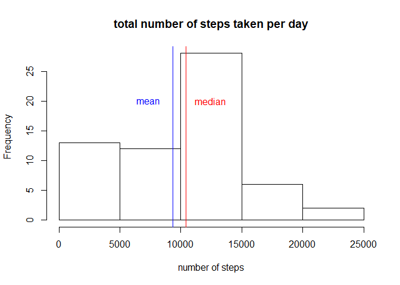
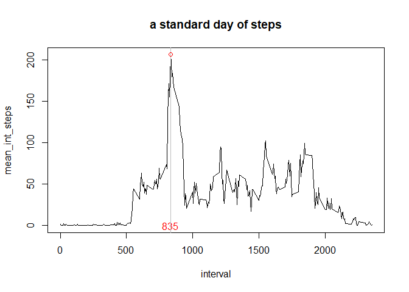
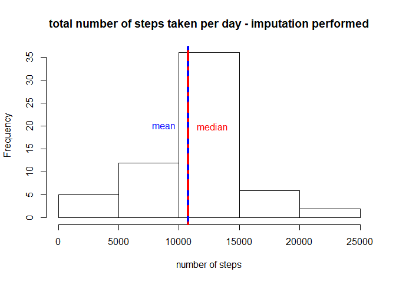
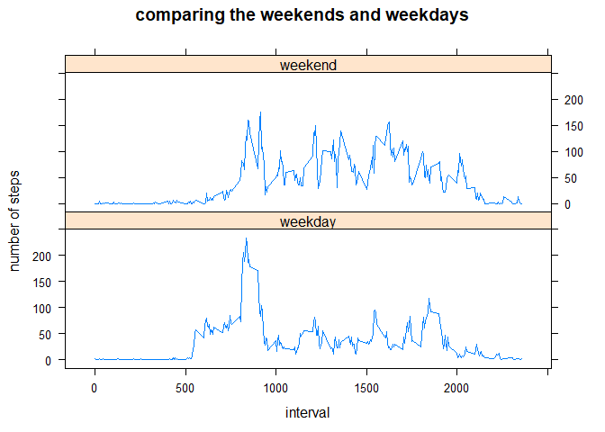

** MESSAGE TO THE REVIEWER **

the current Rstudefault is to save image in the **(file_name)_files** folder.

Please find the figures into **"PA1_template_files\figure-html"**


```r
library(readr)
library(dplyr)
```

```
## 
## Attaching package: 'dplyr'
```

```
## The following objects are masked from 'package:stats':
## 
##     filter, lag
```

```
## The following objects are masked from 'package:base':
## 
##     intersect, setdiff, setequal, union
```

```r
library(ggplot2)
```

## Loading and preprocessing the data

```r
activity <- read_csv('activity.zip')
```

```
## Parsed with column specification:
## cols(
##   steps = col_double(),
##   date = col_date(format = ""),
##   interval = col_double()
## )
```

```r
str(activity)
```

```
## Classes 'spec_tbl_df', 'tbl_df', 'tbl' and 'data.frame':	17568 obs. of  3 variables:
##  $ steps   : num  NA NA NA NA NA NA NA NA NA NA ...
##  $ date    : Date, format: "2012-10-01" "2012-10-01" ...
##  $ interval: num  0 5 10 15 20 25 30 35 40 45 ...
##  - attr(*, "spec")=
##   .. cols(
##   ..   steps = col_double(),
##   ..   date = col_date(format = ""),
##   ..   interval = col_double()
##   .. )
```


## What is mean total number of steps taken per day?


```r
sum_step_day <-
  activity %>% 
  group_by(date) %>% 
  summarise(step_day = sum(steps,na.rm = TRUE))

mean_step_day <- mean(sum_step_day$step_day, na.rm = TRUE)
median_step_day <- median(sum_step_day$step_day, na.rm = TRUE)
```

With NA removed, the median is 10395 and the mean is 9354.2295082 steps per day


```r
hist(sum_step_day$step_day, 
     main = 'total number of steps taken per day',
     xlab = 'number of steps')
abline(v=mean_step_day,col='blue')
text(mean_step_day - 2000, 20, 'mean', col = 'blue')
abline(v=median_step_day,col='red')
text(median_step_day + 2000, 20, 'median', col = 'red')
```

<!-- -->

## What is the average daily activity pattern?


```r
int_mean <-
  activity %>% 
  group_by(interval) %>% 
  summarise(mean_int_steps = mean(steps, na.rm = TRUE))

max_avg_step = 
  int_mean %>% 
  arrange(desc(mean_int_steps)) %>% 
  top_n(n=1,wt=mean_int_steps)

plot(int_mean, type='l', main='a standard day of steps'); text(x=max_avg_step$interval, y=0, as.character(max_avg_step$interval), col='red');
abline(v=max_avg_step$interval, col = 'grey')
points(max_avg_step, col = 'red')
```

<!-- -->

Maximum number of steps in the **835th** interval.


## Imputing missing values


```r
na_count = is.na(activity$steps) %>% sum
```

There are 2304 NAs in the *activity* dataset.

We are going to impute the NAs with the average value on the associated interval and save it in the **steps_imputed** variable


```r
activity_na_imputed <-
  activity %>%
  left_join(int_mean, by='interval') %>% 
  mutate(steps = coalesce(steps, mean_int_steps)) %>% 
  select(date, interval, steps)
```


```r
sum_step_day_imputed <-
  activity_na_imputed %>% 
  group_by(date) %>% 
  summarise(step_day = sum(steps,na.rm = TRUE))

mean_step_day_imputed <- mean(sum_step_day_imputed$step_day, na.rm = TRUE)
median_step_day_imputed <- median(sum_step_day_imputed$step_day, na.rm = TRUE)

diff_mean <- mean_step_day_imputed - mean_step_day
diff_median <- median_step_day_imputed - median_step_day
```

With NA imputed, the median is 10766.1886792453 and the mean is 10766.1886792453 steps per day.
Compared with the NA remove statistics, the median is changed by 371.1886792 and the mean by 1411.959171.
It clearly have an impact, mostly on the mean.


```r
hist(sum_step_day_imputed$step_day, 
     main = 'total number of steps taken per day - imputation performed',
     xlab = 'number of steps')
abline(v=mean_step_day_imputed,col='blue',lwd=4)
text(mean_step_day_imputed - 2000, 20, 'mean', col='blue')
abline(v=median_step_day_imputed,col='red', lty=10, lwd=4)
text(median_step_day_imputed + 2000, 20, 'median', col = 'red')
```

<!-- -->


## Are there differences in activity patterns between weekdays and weekends?


```r
weekend <-
activity %>% 
  mutate(day_type = as.factor(ifelse(weekdays(date) %in% c('Samstag', 'Sonntag'), 'weekend', 'weekday'))) %>% 
  group_by(interval, day_type) %>% 
  summarise(avg_daily = mean(steps,na.rm = TRUE))

library(lattice)

xyplot(avg_daily ~ interval | day_type, data=weekend, type='l',layout = c(1,2),
       xlab='interval', ylab='number of steps', main= 'comparing the weekends and weekdays')
```

<!-- -->

